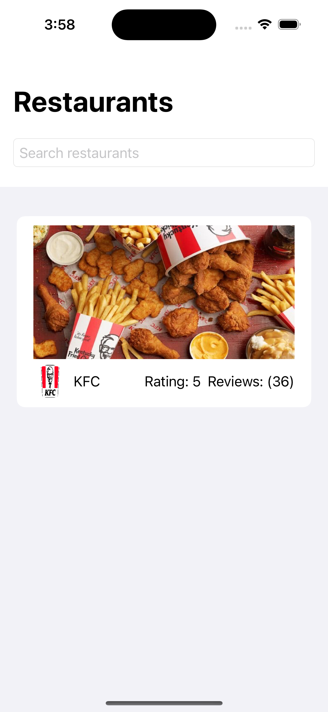
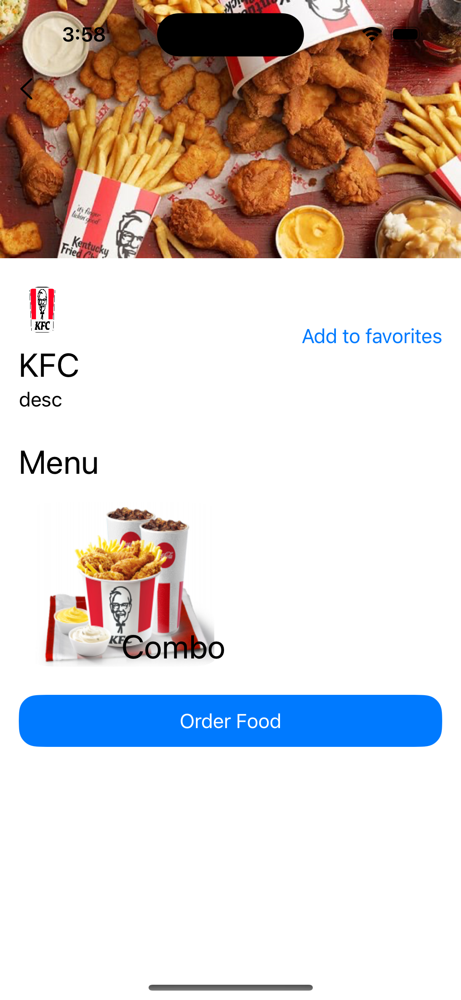
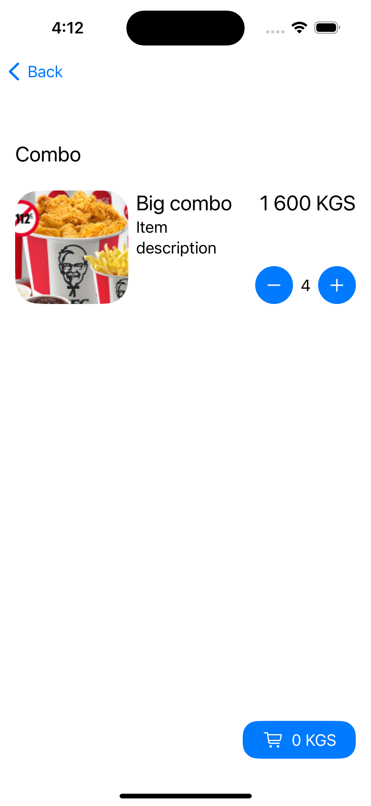
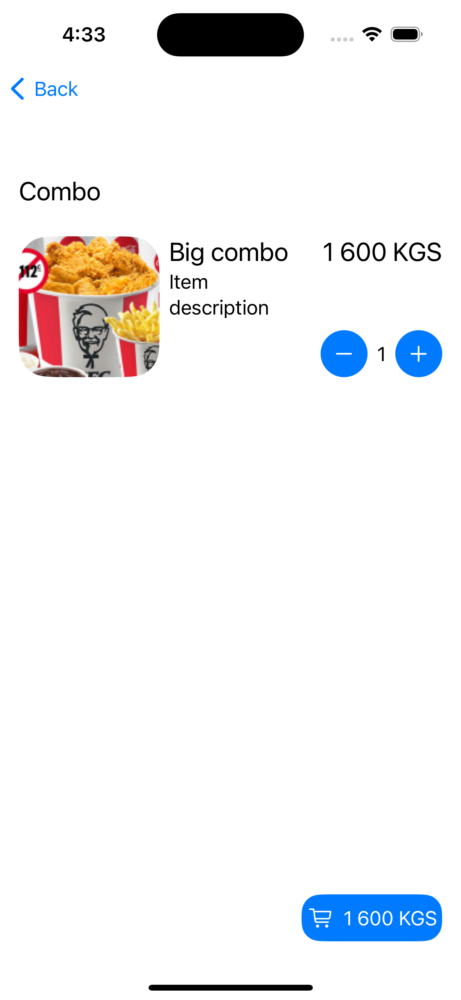

# FancyFood

The project is a mobile application for ordering food from restaurants. I wrote iOS application on SwiftUI. For image loading I used KingFisher. I couldn't find any suitable APIs so I used Firebase Firestore. For save cart information I used Realm.

# Screenshots

# Video description
https://drive.google.com/file/d/1NjUXGJF_0kj6rlBV6U38ptCUOjIaWifZ/view?usp=sharing
https://drive.google.com/file/d/1NjUXGJF_0kj6rlBV6U38ptCUOjIaWifZ/view?usp=sharing
